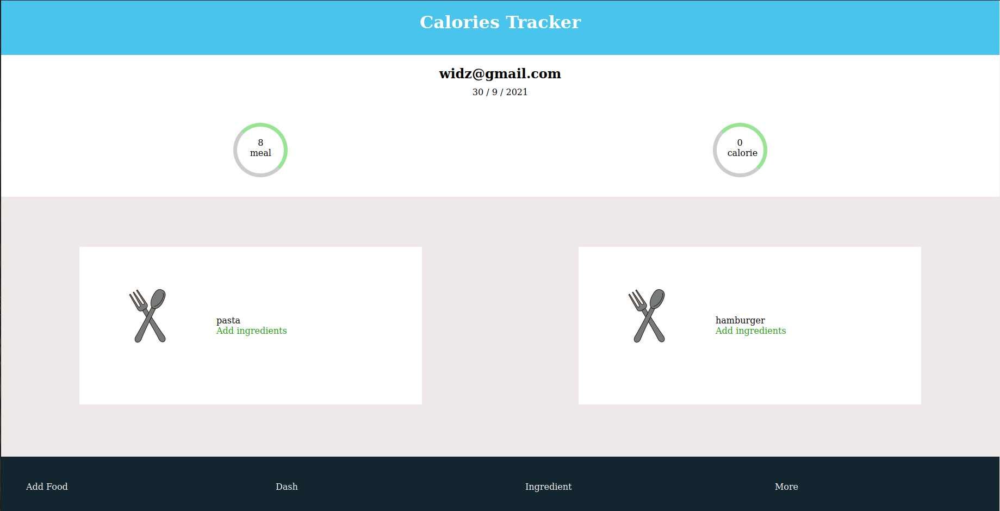
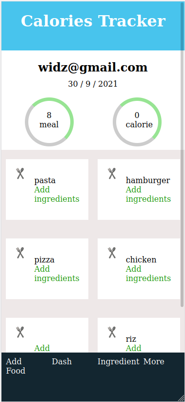

# REACT CATALOG OF RECIPES

> This is the frond end of a food tracker app.

   
   
   
   
   
   
   

## Watch the Live Version

[Live Demo](https://rocky-island-78713.herokuapp.com/)

## ScreenShots

### Big screen

### Small screen

### Prerequisites

- JavaScript ES6
- React
- NodeJS
- Code Editor(VScode)

### Usage

1. Clone the repository by using the `git@github.com:widzthedvloper/calories-tracker-frontend.git` command in your terminal
2. `cd` into the cloned repository
3. Run `npm install or npm i`
4. Open the codebase using any code editor of your choice, preferably, visual studio code editor.
5. Open the vscode terminal and run the application by typing `npm start` and hit enter.
6. Run `npm test` to test the app

## Design idea

- Gregoire Vella
- [Design on Behance](https://www.behance.net/gallery/13271423/Bodytrackit-An-iOs-app-Branding-UX-and-UI)

## Contributing

This project is for educational purposes.

👤 **Widzmarc Jean Nesly Phelle**

- GitHub: [@widzthedvloper](https://github.com/widzthedvloper)
- Twitter - [@widzthedvloper](https://twitter.com/widzthedvloper)
- LinkedIn: [@widzthedvloper](https://www.linkedin.com/in/widzmarc-jean-nesly-phelle-252a26129/)

### Show your support

Give a ⭐️ if you like this project!

## License

MIT License
